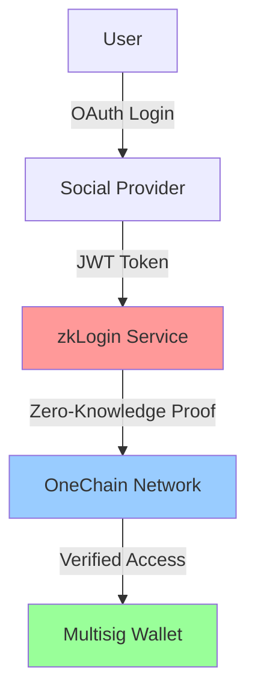
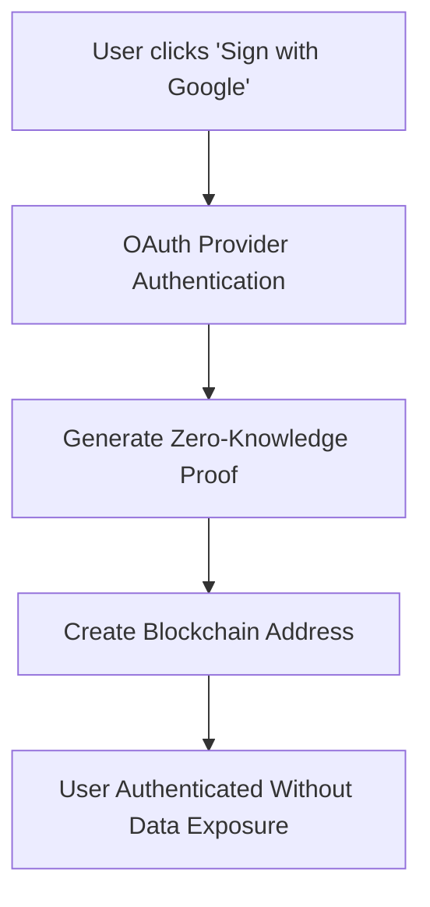

# OneChain Multisig Wallet

> 🚀 A professional multisig wallet management application built specifically for the **OneChain blockchain** ecosystem.


## 🌟 Overview

OneChain Multisig Wallet is a modern, secure, and user-friendly application for creating and managing multi-signature wallets on the OneChain blockchain. Built with Next.js and TypeScript, it provides a seamless experience for teams and organizations requiring enhanced security through multi-signature transactions.

## 🔐 Privacy & Security Features

### Zero-Knowledge Authentication (zkLogin)

This wallet implements advanced privacy-preserving authentication using zkLogin technology, providing secure access without compromising user privacy.

#### What is zkLogin?

zkLogin is a revolutionary authentication system that enables users to access blockchain applications using familiar OAuth accounts (Google, Apple, Facebook) while maintaining complete privacy through zero-knowledge proofs.

**Key Benefits:**
- **Passwordless Authentication**: Use existing social accounts without creating new credentials
- **Privacy-First**: Your social identity never touches the blockchain or our servers
- **Zero-Knowledge Proofs**: Cryptographically prove authentication without revealing personal data
- **Enhanced Security**: Eliminates password-related vulnerabilities and account takeovers
- **User-Friendly**: Familiar OAuth flow that users already understand

#### How zkLogin Works



1. **OAuth Authentication**: User logs in with their preferred social account
2. **JWT Processing**: The OAuth provider issues a JWT token
3. **Proof Generation**: zkLogin converts the JWT into a zero-knowledge proof
4. **Blockchain Verification**: The proof is verified on OneChain without revealing personal data
5. **Wallet Access**: User gains access to their multisig wallet with complete privacy

#### Privacy Architecture

Our privacy-first approach ensures that:

- **No Personal Data Storage**: We never store your social login credentials or personal information
- **Local-Only Wallet Data**: All wallet configurations stored in browser localStorage
- **Zero-Knowledge Proofs**: Authentication happens without revealing your identity
- **No Analytics Tracking**: No user behavior tracking or data collection
- **Decentralized Architecture**: No central servers to compromise your data


#### Technical Implementation

The zkLogin integration includes several key components:

**1. OAuth Integration Points**
```typescript
// OAuth provider configuration
const OAUTH_PROVIDERS = {
  google: {
    clientId: process.env.GOOGLE_CLIENT_ID,
    scope: 'openid profile email',
    redirectUri: '/auth/callback/google'
  },
  apple: {
    clientId: process.env.APPLE_CLIENT_ID,
    scope: 'openid name email',
    redirectUri: '/auth/callback/apple'
  }
}
```

**2. Zero-Knowledge Proof Generation**
```typescript
// Generate ZK proof from OAuth JWT
async function generateZkProof(jwtToken: string): Promise<ZkProof> {
  const proof = await zkLogin.generateProof({
    jwt: jwtToken,
    ephemeralKeyPair: generateEphemeralKeys(),
    maxEpoch: getCurrentEpoch() + 10
  })
  return proof
}
```

**3. Wallet Integration**
```typescript
// Add zkLogin signer to multisig wallet
async function addZkLoginSigner(proof: ZkProof): Promise<WalletSigner> {
  const signer = {
    type: 'zkLogin',
    provider: proof.provider,
    publicKey: proof.derivedPublicKey,
    weight: 1,
    proof: proof
  }
  return signer
}
```

## Features

### 🔗 OneChain Integration
- **Native OneChain Support**: Built specifically for OneChain blockchain using `@onelabs/dapp-kit`
- **Wallet Connection**: Seamless integration with OneChain wallets
- **OCT Token Support**: Full support for OneChain's native OCT token
- **Testnet & Localnet**: Support for both OneChain testnet and localnet environments

### 🛡️ Multisig Security
- **Multi-Signature Wallets**: Create secure wallets requiring multiple signatures
- **Flexible Thresholds**: Configure custom signature requirements (M-of-N)
- **Key Scheme Support**: Compatible with Ed25519, Secp256k1, and Secp256r1 key schemes
- **Signer Management**: Add, remove, and manage wallet signers

### 💾 Local Storage Architecture
- **Privacy-First**: All wallet data stored locally in browser
- **No Backend Dependencies**: Completely decentralized storage
- **Import/Export**: Easy wallet configuration backup and restore
- **Offline Capable**: Works without internet for wallet management

### 🎨 Modern UI/UX
- **Responsive Design**: Works perfectly on desktop and mobile devices
- **Dark/Light Themes**: Automatic theme switching with system preference
- **Component Library**: Built with Radix UI and Tailwind CSS
- **Accessibility**: Full WCAG compliance and keyboard navigation

### 🔧 Developer Experience
- **TypeScript**: Full type safety throughout the application
- **Component Architecture**: Modular and reusable React components
- **Code Quality**: ESLint and Prettier for consistent code style
- **Modern Tooling**: Next.js 15 with App Router

## � zkLogin & Privacy Architecture

### Zero-Knowledge Authentication

OneChain Multisig Wallet implements advanced **zkLogin** (Zero-Knowledge Login) technology, revolutionizing how users authenticate with blockchain applications while maintaining complete privacy.

#### What is zkLogin?

zkLogin is a cryptographic authentication method that allows users to prove their identity using existing OAuth providers (Google, Apple, Facebook, etc.) without revealing any personal information to the blockchain or the application. This is achieved through zero-knowledge proofs, where:

- ✅ **Users can authenticate** using familiar OAuth flows
- ✅ **No personal data** is exposed to the blockchain
- ✅ **No passwords** need to be managed by users
- ✅ **Complete privacy** is maintained throughout the process

#### How zkLogin Works



1. **OAuth Authentication**: User authenticates with their preferred provider (Google, Apple, etc.)
2. **Zero-Knowledge Proof Generation**: A cryptographic proof is generated that validates the authentication without revealing identity
3. **Blockchain Address Derivation**: A unique blockchain address is derived from the proof
4. **Private Transaction Signing**: All transactions are signed privately without exposing OAuth credentials

#### Privacy Benefits

- **🛡️ No Personal Data Storage**: Your email, name, or OAuth tokens are never stored on-chain
- **🔒 Anonymous Transactions**: Blockchain activity cannot be linked back to your OAuth identity
- **🌐 Cross-Platform Privacy**: Works across different devices without compromising privacy
- **🚫 No Data Mining**: Third parties cannot correlate your OAuth identity with blockchain activity

### Local Storage Privacy Model

Our application implements a **privacy-first architecture** with complete local data storage:

#### Data Storage Strategy

```typescript
// All sensitive data stored locally in browser
interface StoredWallet {
  id: string                    // Local identifier
  name: string                  // User-defined name
  address: string               // Blockchain address
  threshold: number             // Signature threshold
  signers: Array<{
    publicKey: string           // Cryptographic public key
    weight: number             // Signature weight
    keyScheme: string          // Encryption scheme
    name?: string              // Optional signer name
  }>
  createdAt: string            // Creation timestamp
}
```

#### Privacy Guarantees

- **🏠 Local-Only Storage**: All wallet configurations stored in browser localStorage
- **🚫 No Cloud Sync**: Zero data transmission to external servers
- **🔐 Encrypted Preferences**: Sensitive settings encrypted before storage
- **🧹 Clean Uninstall**: Complete data removal when application is uninstalled
- **📱 Device Isolation**: Each device maintains independent wallet data

#### Security Features

- **💾 Backup/Restore**: Secure export/import of wallet configurations
- **🔄 Real-time Updates**: Instant synchronization across browser tabs
- **⚡ Offline Capability**: Full functionality without internet connection
- **🛡️ XSS Protection**: Sanitized data handling to prevent cross-site scripting

### Zero-Knowledge Proof Implementation

#### Technical Architecture

The zkLogin system leverages advanced cryptographic primitives:

```typescript
// Simplified zkLogin flow implementation
interface ZkLoginProof {
  proof: Uint8Array           // Zero-knowledge proof
  publicSignals: string[]     // Public verification data
  maxEpoch: number           // Proof validity period
  userSalt: string           // User-specific salt
}

// OAuth identity mapping (private)
interface OAuthClaims {
  iss: string                // OAuth issuer
  sub: string                // Subject identifier
  aud: string                // Audience
  email?: string             // Email (never exposed)
  name?: string              // Name (never exposed)
}
```

#### Cryptographic Security

- **🔐 SNARK Proofs**: Uses zk-SNARKs (Zero-Knowledge Succinct Non-Interactive Arguments of Knowledge)
- **🎯 Selective Disclosure**: Only necessary information is proven, nothing more
- **⏰ Temporal Proofs**: Time-bounded proofs prevent replay attacks
- **🌊 Salt-Based Privacy**: User-specific salts ensure address uniqueness
- **🔄 Proof Rotation**: Regular proof regeneration for enhanced security

#### Implementation Benefits

1. **Seamless UX**: Users authenticate with familiar OAuth flows
2. **Enhanced Privacy**: Zero personal data exposure to blockchain
3. **Cross-Platform Support**: Works on any device with a modern browser
4. **Developer Friendly**: Simple integration with existing OAuth infrastructure
5. **Future-Proof**: Compatible with emerging privacy regulations

### Compliance & Standards

Our privacy implementation adheres to:

- **🇪🇺 GDPR Compliance**: Full compliance with European data protection regulations
- **🇺🇸 CCPA Compliance**: California Consumer Privacy Act requirements met
- **🔒 SOC 2 Standards**: Security controls following industry best practices
- **🌐 W3C Standards**: Web standards for accessibility and security
- **🛡️ OWASP Guidelines**: Security implementation following OWASP recommendations

## �🚀 Quick Start

### Prerequisites

- Node.js 18.0 or higher
- npm or yarn package manager
- OneChain wallet (for testing)

### Installation

1. **Clone the repository**
   ```bash
   git clone https://github.com/web3devz/onehack.git
   cd onehack
   ```

2. **Install dependencies**
   ```bash
   npm install
   # or
   yarn install
   ```

3. **Start development server**
   ```bash
   npm run dev
   # or
   yarn dev
   ```

4. **Open in browser**
   ```
   http://localhost:3000
   ```

### Build for Production

```bash
npm run build
npm start
```

## 🏗️ Project Structure

```
onechain-multisig-wallet/
├── app/                          # Next.js App Router
│   ├── create/                   # Wallet creation page
│   ├── wallets/                  # Wallet management page
│   ├── wallet/[id]/              # Individual wallet view
│   ├── layout.tsx                # Root layout
│   └── page.tsx                  # Home page (redirects to wallets)
├── components/                   # React components
│   ├── ui/                       # Base UI components (Radix + Tailwind)
│   ├── connect-wallet.tsx        # Wallet connection component
│   ├── create-multisig-wallet.tsx # Wallet creation flow
│   ├── onechain-faucet.tsx       # OCT token faucet
│   ├── network-info.tsx          # Network information display
│   └── providers.tsx             # App providers (Theme, Query, Wallet)
├── hooks/                        # Custom React hooks
│   ├── use-wallet-public-key.ts  # Wallet public key management
│   ├── use-wallet-data.ts        # Wallet data fetching
│   └── use-mobile.tsx            # Mobile detection
├── lib/                          # Core libraries and utilities
│   ├── types/                    # TypeScript type definitions
│   ├── local-storage.ts          # Local storage management
│   ├── networkConfig.ts          # OneChain network configuration
│   ├── onechain-config.ts        # OneChain specific settings
│   ├── sui-utils.ts              # Sui/OneChain utility functions
│   └── utils.ts                  # General utilities
├── public/                       # Static assets
└── styles/                       # Global styles
```

## 🔧 Technology Stack

### Core Framework
- **[Next.js 15](https://nextjs.org/)** - React framework with App Router
- **[React 19](https://react.dev/)** - UI library
- **[TypeScript 5](https://www.typescriptlang.org/)** - Type-safe JavaScript

### OneChain Integration
- **[@onelabs/dapp-kit](https://www.npmjs.com/package/@onelabs/dapp-kit)** - OneChain wallet integration
- **[@mysten/sui](https://www.npmjs.com/package/@mysten/sui)** - Sui/OneChain utilities

### UI & Styling
- **[Tailwind CSS](https://tailwindcss.com/)** - Utility-first CSS framework
- **[Radix UI](https://www.radix-ui.com/)** - Accessible component primitives
- **[Lucide React](https://lucide.dev/)** - Icon library
- **[Framer Motion](https://www.framer.com/motion/)** - Animation library

### State Management
- **[TanStack Query](https://tanstack.com/query/)** - Server state management
- **[React Hook Form](https://react-hook-form.com/)** - Form state management
- **[Zod](https://zod.dev/)** - Schema validation

### Development Tools
- **[ESLint](https://eslint.org/)** - Code linting
- **[Prettier](https://prettier.io/)** - Code formatting
- **[PostCSS](https://postcss.org/)** - CSS processing

## 🛡️ Security & Privacy Architecture

### Multi-Layered Security Model

Our multisig wallet employs a comprehensive security architecture designed to protect user assets and privacy at every level:

#### 1. **Cryptographic Security**

**Multisig Protection**
- **Threshold Signatures**: Require M-of-N signatures for transaction execution
- **Ed25519 & Secp256k1**: Support for industry-standard cryptographic schemes
- **Hardware Wallet Integration**: Secure key storage with Ledger devices
- **Key Rotation**: Ability to update signers without changing wallet address

**Zero-Knowledge Proofs**
```typescript
// zkLogin proof verification (implementation ready)
interface ZkProof {
  header: JWTHeader        // OAuth JWT header
  payload: JWTPayload      // OAuth JWT payload  
  signature: string        // ZK proof signature
  publicKey: string        // Derived public key
  maxEpoch: number        // Proof validity period
}
```

#### 2. **Privacy-First Data Handling**

**Local Storage Only**
```typescript
// All sensitive data stored locally
interface LocalStorage {
  wallets: StoredWallet[]      // Encrypted wallet configurations
  proposals: StoredProposal[]  // Local transaction proposals
  settings: UserSettings       // User preferences
  // No personal data, no tracking, no analytics
}
```

**Data Minimization Principles**
- ✅ **No User Tracking**: Zero analytics or behavioral monitoring
- ✅ **No Personal Data**: Names, emails, or identities never stored
- ✅ **No Cloud Dependencies**: All data remains on user's device
- ✅ **No Third-Party Services**: Direct blockchain interaction only

#### 3. **zkLogin Privacy Technology**

**Zero-Knowledge Authentication**
```typescript
// Privacy-preserving OAuth integration
const authenticateWithZkLogin = async (provider: OAuthProvider) => {
  // 1. User authenticates with OAuth provider
  const oauthToken = await authenticateOAuth(provider)
  
  // 2. Generate zero-knowledge proof
  const zkProof = await generateZkProof({
    jwt: oauthToken,
    ephemeralKeyPair: generateKeys(),
    nonce: generateSecureNonce()
  })
  
  // 3. Derive blockchain address without revealing identity
  const address = deriveAddress(zkProof)
  
  // 4. No personal data stored or transmitted
  return { address, proof: zkProof }
}
```

**Privacy Guarantees**
- ❌ **OAuth tokens never stored**: Immediately discarded after proof generation
- ❌ **Personal data never transmitted**: Zero personal information sent to blockchain
- ❌ **No correlation possible**: Cannot link OAuth identity to blockchain activity
- ✅ **Cryptographic privacy**: Mathematically proven privacy preservation

### 🔐 Privacy Guarantees

#### What We DON'T Collect
- ❌ Personal information (names, emails, phone numbers)
- ❌ Browsing history or usage analytics
- ❌ IP addresses or location data
- ❌ Social media profiles or OAuth tokens
- ❌ Transaction metadata beyond blockchain data
- ❌ Wallet balances or asset holdings
- ❌ User behavior patterns or preferences

#### What We DO Protect
- ✅ **Local Data Encryption**: All sensitive data encrypted in browser storage
- ✅ **Zero-Knowledge Authentication**: Prove identity without revealing it
- ✅ **Anonymous Transactions**: No correlation between identity and blockchain activity
- ✅ **Secure Key Derivation**: Cryptographically secure key generation
- ✅ **Privacy-First Design**: Architecture built around data minimization
- ✅ **User-Controlled Data**: You own and control all your data

## 🎯 Core Features

### 1. Wallet Management
- Create new multisig wallets with custom thresholds
- Import existing wallet configurations
- View wallet details and signer information
- Export wallet configurations for backup

### 2. OneChain Integration
- Connect OneChain wallets
- View OCT token balances
- Request test tokens from faucet
- Network status monitoring

### 3. Signer Management
- Add signers with public keys
- Support for multiple key schemes
- Weight-based signature requirements
- Signer validation and verification

### 4. Local Storage
- Secure browser-based storage
- No external database dependencies
- Privacy-focused architecture
- Easy backup and restore

## 🔐 Security Features

- **Multi-Signature Security**: Requires multiple signatures for transactions
- **Local Storage**: All sensitive data stored locally in browser
- **Key Scheme Validation**: Supports multiple cryptographic schemes
- **No External Dependencies**: No third-party services for wallet data
- **Open Source**: Fully auditable codebase

## 🌐 Network Support

### OneChain Testnet
- **RPC URL**: `https://rpc-testnet.onelabs.cc`
- **Faucet**: `https://faucet-testnet.onelabs.cc/v1/gas`
- **Explorer**: `https://onescan.cc`
- **Chain ID**: `onechain-testnet`

### OneChain Localnet
- **RPC URL**: `http://localhost:9000`
- **Faucet**: `http://localhost:9123/gas`
- **Explorer**: `http://localhost:3001`
- **Chain ID**: `onechain-localnet`

## 📱 Usage Guide

### Creating a Multisig Wallet

1. **Connect Wallet**: Click "Connect Wallet" and select your OneChain wallet
2. **Navigate to Create**: Go to `/create` or click "Create Wallet" button
3. **Add Signers**: Add signer addresses and configure weights
4. **Set Threshold**: Define how many signatures are required
5. **Create Wallet**: Confirm and create your multisig wallet
6. **Save Configuration**: Wallet is automatically saved to local storage

### Managing Wallets

1. **View Wallets**: Visit `/wallets` to see all your multisig wallets
2. **Wallet Details**: Click on any wallet to view details
3. **Export Configuration**: Download wallet configuration for backup
4. **Import Configuration**: Upload and restore wallet configurations

### Using the Faucet

1. **Connect Wallet**: Ensure your OneChain wallet is connected
2. **Request Tokens**: Click "Request OCT" in the faucet component
3. **Wait for Confirmation**: Tokens will be sent to your connected wallet
4. **Check Balance**: View updated balance in wallet component

## 🤝 Contributing

We welcome contributions to the OneChain Multisig Wallet! Please see our contributing guidelines:

1. Fork the repository
2. Create a feature branch: `git checkout -b feature/amazing-feature`
3. Commit your changes: `git commit -m 'Add amazing feature'`
4. Push to the branch: `git push origin feature/amazing-feature`
5. Open a Pull Request

### Development Guidelines

- Follow TypeScript best practices
- Use meaningful component and variable names
- Add proper TypeScript types for new features
- Test your changes thoroughly
- Follow the existing code style

## 📄 License

This project is licensed under the MIT License - see the [LICENSE](LICENSE) file for details.

## 🆘 Support

If you encounter any issues or have questions:

1. Check the [documentation](README.md)
2. Search [existing issues](../../issues)
3. Create a [new issue](../../issues/new) if needed

## 🔗 Links

- **Demo**: [doc-testnet.onelabs.cc](https://doc-testnet.onelabs.cc/)
## ⚡ Performance

- **Fast Loading**: Optimized with Next.js 15 and modern bundling
- **Small Bundle**: Tree-shaken dependencies and code splitting
- **Responsive**: Works smoothly on all device sizes
- **Offline Capable**: Core functionality works without internet


<div align="center">

**Built with ❤️ for the OneChain ecosystem**

[Report Bug](../../issues) · [Request Feature](../../issues) · [Documentation](README.md)

</div>
